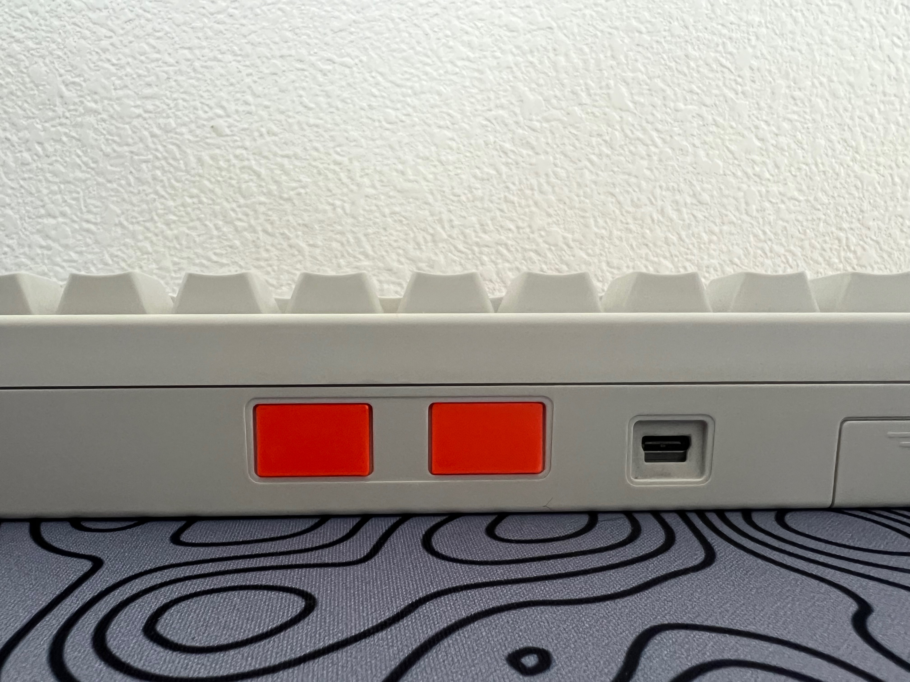

# HHKB-usb-dust-covers

3D Printable dust covers for the HHKB originally created by alienman82 on the geekhack.org forums from this [post](https://geekhack.org/index.php?PHPSESSID=l77tgar58dsjjq3enpog7vvlobqqn017&topic=12047.msg1752328#msg1752328).

pursa gcode for petg with 0.4mm nozzle diameter.

example printed with pursa mk3s with petg filament with hhkb pro 2 and hasu usb c controller.

